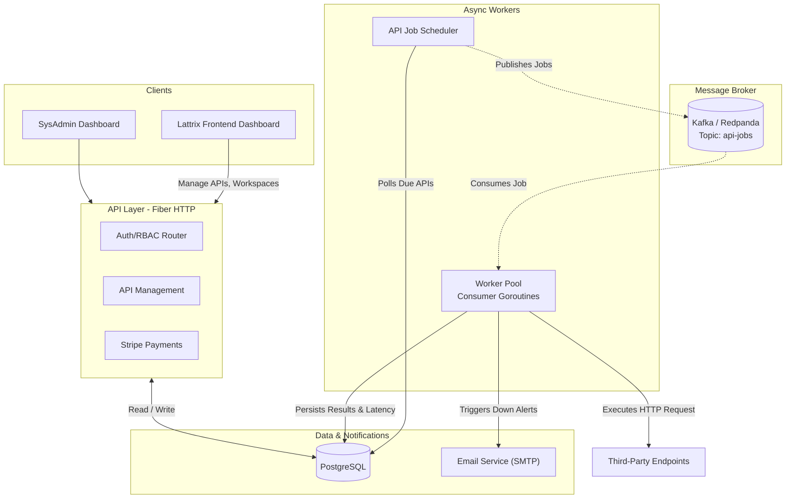

# Lattrix 🚀

Lattrix is a fast, scalable, and robust API Uptime Monitoring and Analytics platform. It empowers developers and teams to monitor their API endpoints, track uptime, decompose latency bottlenecks (DNS, TCP, TLS, TTFB), and get instant alerts when things go wrong.

Built for B2B SaaS teams, Lattrix supports workspaces, detailed role-based access control (RBAC), and subscription-based billing via Stripe. The backend is written in **Go** utilizing the **Fiber** framework for high-throughput HTTP handling, backed by **PostgreSQL** for persistence and **Kafka** (Redpanda) for scalable, distributed API health checking.

---

## 🌟 Key Features

- **Advanced API Monitoring:** Schedule uptime checks, validate response payloads, check HTTP status codes, and track latency metrics (DNS, TCP, TLS, Processing/TTFB, Transfer times).
- **SSL Certificate Tracking:** Automatically monitors SSL certificate validity and warns about upcoming expirations.
- **Distributed Worker Architecture:** Leverages Kafka to distribute uptime "checks" to a concurrent pool of background workers (24 concurrent goroutines per consumer instance).
- **Workspaces & Collaboration:** Create workspaces to organize your API groups. Invite team members with Role-Based Access Control (RBAC).
- **Incident Alerting:** Real-time workspace notifications and Email alerts immediately notify owners when endpoints fail or degrade over expected parameters.
- **Monetization Built-In:** Integrated with Stripe for Pro and Agency subscription tiers.
- **System Administration:** Built-in Sysadmin roles and controls for complete platform management.

---

## 🏗 Architecture Overview

Lattrix acts as a centralized server that manages user requests while efficiently offloading the actual HTTP checking work to consumer workers via a message broker.



---

## 🛠 Tech Stack

- **Language:** Go (1.25)
- **Framework:** Fiber (v2)
- **Database:** PostgreSQL (with GORM & `gorm.io/datatypes`)
- **Message Broker:** Kafka (using `segmentio/kafka-go`, deployed locally as Redpanda)
- **Payments:** Stripe Go SDK
- **Authentication:** JWT & bcrypt
- **Containerization:** Docker & Docker Compose

---

## 🚀 Getting Started

### Prerequisites

- Go 1.25+
- Docker and Docker Compose
- A Stripe account (for testing subscriptions)
- PostgreSQL (if running bare metal instead of Docker)

### Installation

1. **Clone the repository:**
   ```bash
   git clone https://github.com/junaid9001/lattrix-backend.git
   cd lattrix-backend
   ```

2. **Set up Environment Variables:**
   A `.env` file is required in the root directory. You can duplicate the provided defaults and fill in your keys:
   ```env
   DB_HOST=localhost
   DB_USER=postgres
   DB_PASSWORD=your_db_password
   DB_NAME=lattrix
   DB_PORT=5432
   JWT_KEY=your_secure_jwt_secret

   EMAIL=your_email@gmail.com
   EMAIL_PASS=your_app_password

   STRIPE_SECRET_KEY=sk_test_...
   STRIPE_PRICE_PRO=price_...
   STRIPE_PRICE_AGENCY=price_...
   STRIPE_WEBHOOK_SECRET=whsec_...

   SYS_ADMIN_EMAIL=admin@lattrix.com
   SYS_ADMIN_PASSWORD=secure_admin_password

   KAFKA_BROKER=localhost:19092
   FRONTEND_URL=http://localhost:5173
   ```

3. **Start Redpanda (Kafka) Database (Optional):**
   If you want to run the Kafka broker quickly, use the included `docker-compose.yaml`.
   ```bash
   docker-compose up -d redpanda
   ```
   *(Note: You can also choose to spin up the entire backend container via `docker-compose up -d`)*

4. **Install Go Dependencies:**
   ```bash
   go mod tidy
   ```

5. **Run the Application:**
   ```bash
   go run cmd/server/main.go
   ```
   The Fiber server will start on `http://localhost:8080`. The application will automatically run the background job scheduler and fire up 24 worker routines to listen to the Kafka topics.

---

## 📁 Project Structure

```text
lattrix-backend/
├── cmd/
│   └── server/          # Entry point for the Application (main.go)
├── internal/
│   ├── config/          # Environment variable loading
│   ├── consumer/        # Kafka Subscriber implementation
│   ├── domain/models/   # GORM DB models (User, API, Workspace, WorkNotification, etc.)
│   ├── http/            # Controllers, Routers, DTOs, and Middlewares
│   ├── infra/           # DB connections and Database repositories
│   ├── publisher/       # Kafka Publisher implementation
│   ├── server/          # Server configuration and dependency injection wiring
│   ├── services/        # Core business logic / Use cases 
│   ├── utils/           # Helper functions (email, password hashes, etc.)
│   └── worker/          # Job scheduling and async HTTP worker consumer logic
├── docker-compose.yaml  # Container compose file (Redpanda Kafka & Backend)
├── go.mod               # Go module dependencies
└── Dockerfile           # Backend containerization
```

---

## 🤝 Contributing

1. Fork the repo.
2. Create your feature branch (`git checkout -b feature/AmazingFeature`)
3. Commit your changes (`git commit -m 'Add some AmazingFeature'`)
4. Push to the branch (`git push origin feature/AmazingFeature`)
5. Open a Pull Request.

---

**Built with ❤️ for API Reliability.**
